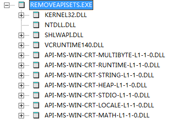
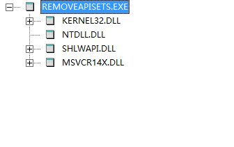

# msvcr14x 
msvcr14x is a program that allows programs compiled with VC2015 and above not to rely on a bunch of useless API-Ms-win-starting DLLS

## prior project:
https://github.com/sonyps5201314/ntdll.git

## build method：
run one_key_build.bat for the first time build or msvcr14x.sln for next times builds

## use method:
run setup.vbs with a account with administrator privileges

## compare images:
Before      After

## extended project:
https://github.com/sonyps5201314/RemoveApiSets.git is a tool for remove ApiSets for existed executable files

## refer to:
https://source.winehq.org/git/wine.git

https://github.com/Microsoft/STL
